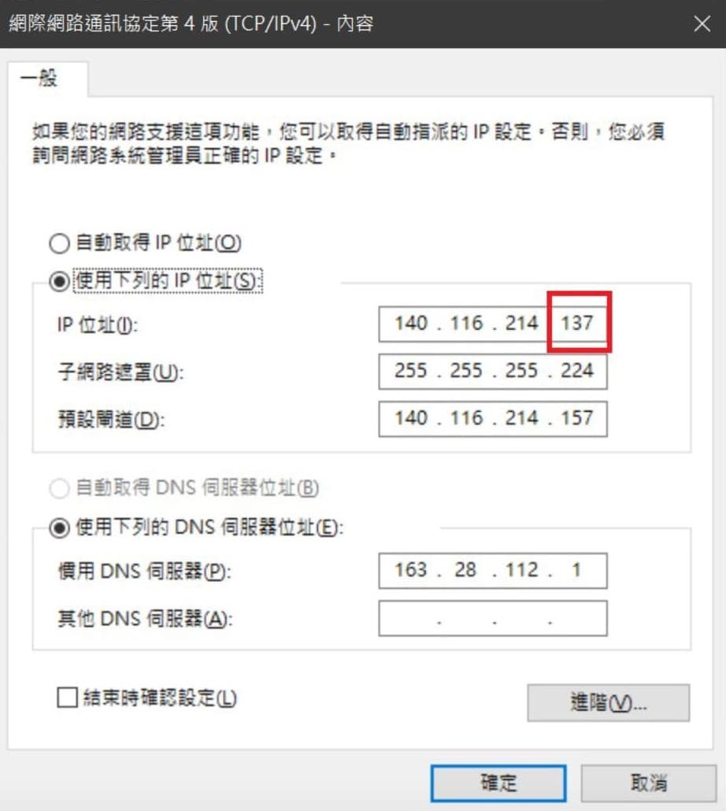
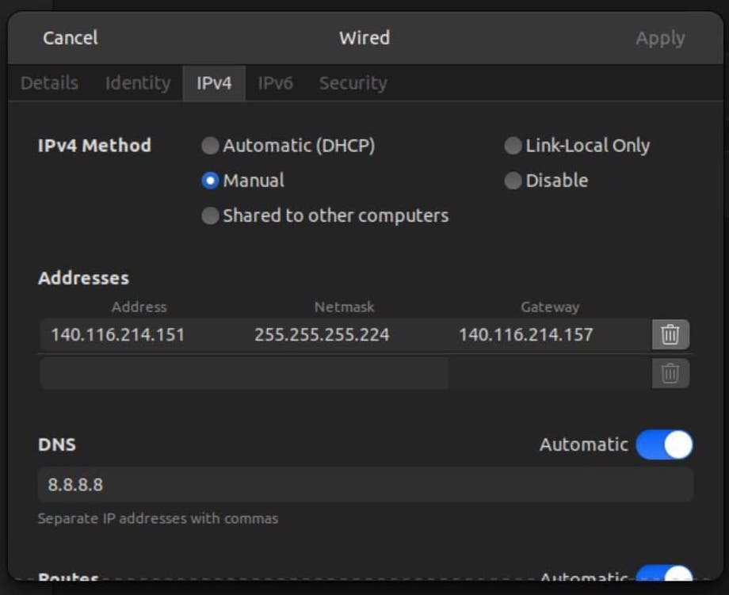
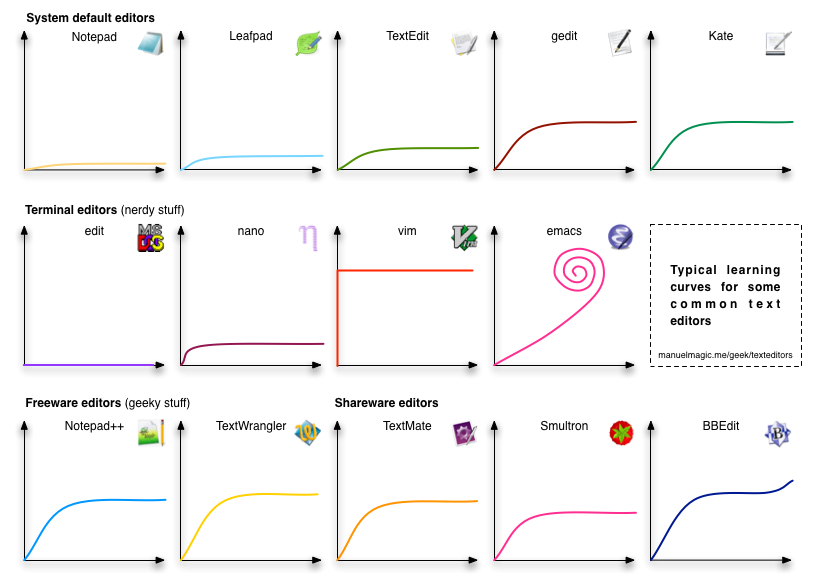
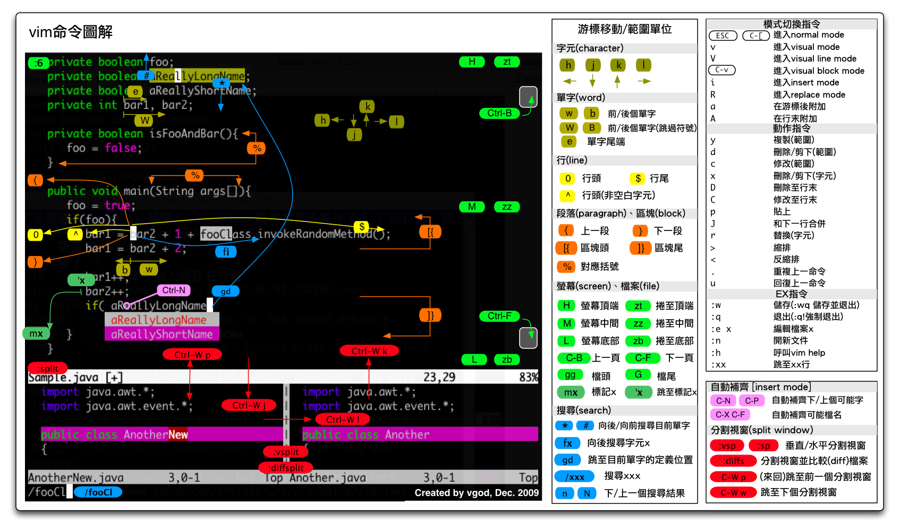
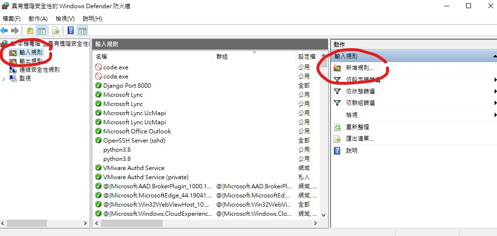
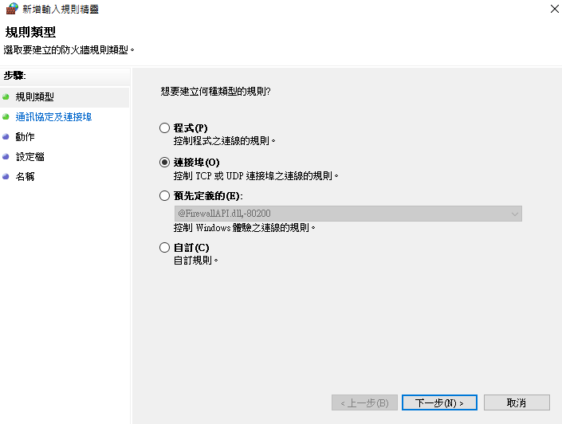
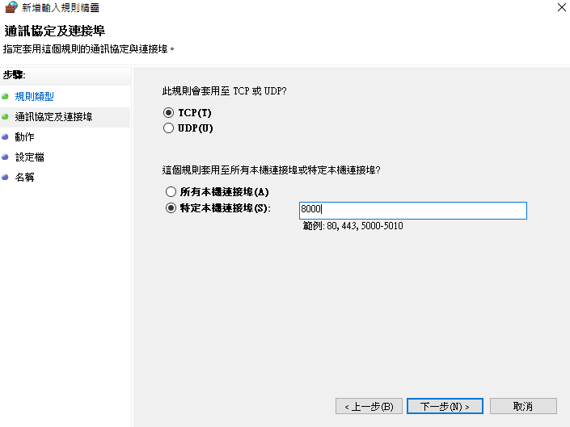
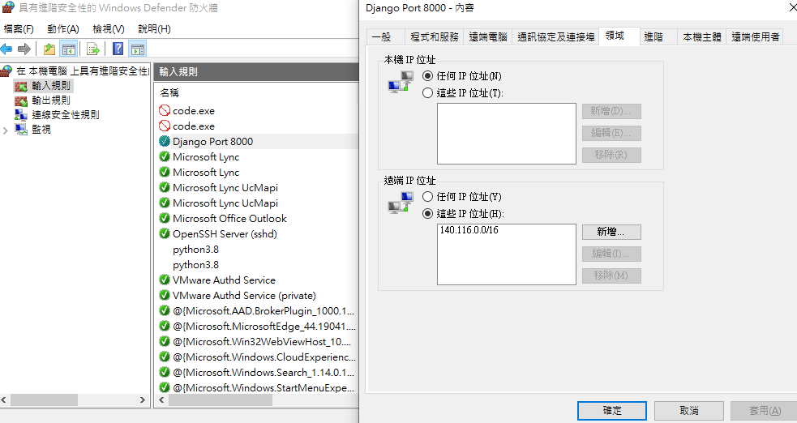
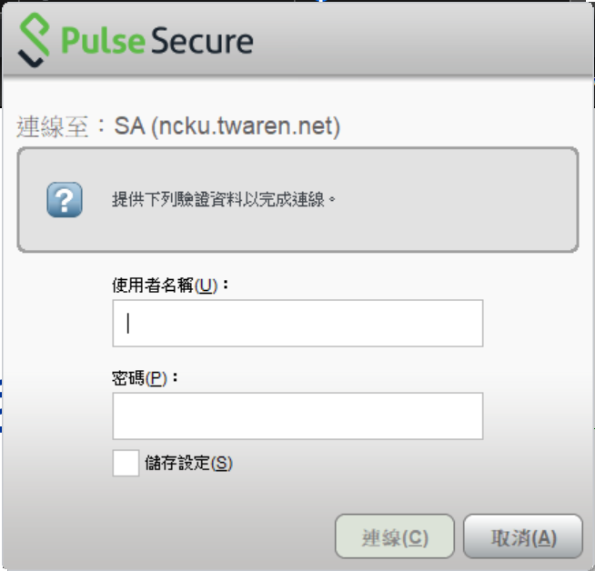
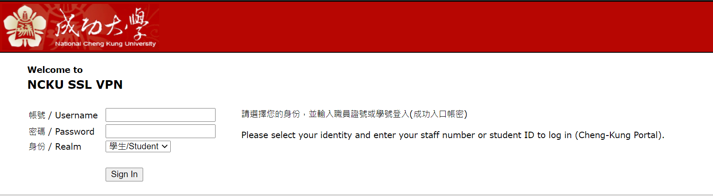

# Lesson1 Linux 

> - Webex 會議錄製檔： 20220704 0602-1 暑假課程第一堂Linux  
>   密碼： Wf2pkkTC  
>   錄製檔鏈結： https://nckucc.webex.com/nckucc/ldr.php?RCID=6f11f8774a5e6415c3b8975ab5ef3013

## Introduction

Linux 指的是 [**Linux Kernel**](https://github.com/torvalds/linux) 作業系統核心，只包含系統層級的基礎元件/功能，而我們使用電腦系統必須還要有 UI（使用者介面）和一些管理程式等等。Linux distributions 則是基於 Linux Kernel 開發的作業系統，不同的 distributions 會預載不同的使用者軟體。

[10 Top Most Popular Linux Distributions of 2021](https://www.tecmint.com/top-most-popular-linux-distributions/)，這是 TecMint 2021 年統計的受歡迎 Linux distributions 排行榜，目前實驗室主要使用 Ubuntu。

- 開源，能夠高度客製化
- 系統構造簡單、穩定、安全
- 較不耗資源
- 文字介面操作較複雜，需要花時間熟悉...

## Installation
### 實體安裝
- 下載需要的 [Ubuntu](https://www.ubuntu-tw.org/modules/tinyd0/) 版本
    - 通常是選擇Ubuntu Desktop(桌面版)，穩定版本(14.04～22.04)，64位元(支持現行大部分電腦)，選好後直接按「開始下載」即可
- 下載 [Rufus](https://rufus.ie/zh_TW/) 製作開機 USB
    - 選擇你的 USB 硬碟和上面下載的 .iso 映像檔案，其他保留預設就好
- 如果你要 Windows + Ubuntu 雙系統 需進行 [磁碟分割](https://www.asus.com/tw/support/FAQ/1044688/)，想純粹安裝 Ubuntu 者略過
- 重開電腦狂點 Del 進入 bios 選擇 usb 開機 (每個電腦廠牌進入點選的按鈕和 bios 設定不同，可上網查)
- 開始安裝 (記得安裝英文版的，中文版資料夾路徑容易產生問題）

### 虛擬機 
- Windows 可以選擇安裝 [VMWare](https://my.vmware.com/en/web/vmware/downloads/info/slug/desktop_end_user_computing/vmware_workstation_player/16_0) 或是 [VirtualBox](https://www.virtualbox.org)
- Mac 可以選擇安裝 [VMWare Fusion](https://www.vmware.com/tw/products/fusion.html) 或 [VirtualBox](https://www.virtualbox.org)


安裝虛擬機後，請啟動並選擇先前載好的 Ubuntu Desktop 鏡像檔。可能會碰到諸如硬碟容量、記憶體大小之類的設定，若沒特殊需求，全部選預設值就行。設定並安裝完畢後，就可以開始使用 Ubuntu 虛擬機了。

### WSL
WSL (Windows Subsystem for Linux) 是 Windows 內建的簡易版 Linux，對於想練習 Linux 但又不想放棄 Windows 的人來說是個好選擇。

用系統管理員身分開啟 cmd，輸入 `wsl.exe --install`，安裝完後重啟電腦，即可使用 WSL。

要使用 WSL，可以直接在 cmd 中輸入 `wsl` 來登入 Ubuntu，或是直接使用安裝好的 Ubuntu 應用程式（會是一個 Ubuntu Shell）。

在 WSL 中，你的 Windows 預設路徑會在 `/mnt/c/Users/<your_name>` ；在 Windows 中，你的 Ubuntu 路徑 **可能** 會在：
```
C:\Users\<your_name>\AppData\Local\Packages\CanonicalGroupLimited.UbuntuonWindows_79rhkp1fndgsc\LocalState\rootfs\home\<your_name>
```
路徑有點長，建議把它存起來，這樣就可以直接在 Windows 上開發你的 Linux 專案。

### 網路設定
- 跟實驗室管理員確認你的固定 IP：140.116.214.xxx
- 照下面設定 address、netmask、gateway
- Windows：<br>
    
- Linux：<br>
    


## Command
- Linux 系統預設使用 `/bin/bash` 作為使用者登入 Shell
- 不知道指令怎麼下參數的話可以加入 `--help` or `-h` 查詢

### 檔案操作
- **ls**：列出檔案內資料
    - **ls -l**：列出詳細資料
    - **ls -a**：列出隱藏資料 (ex: .bashrc)
    - **ll**：結合前兩者
- **less、cat** filename：查看檔案內容
- **head**、**tail** filename：查看檔案頭尾內容
- **rm** filename：刪除檔案
- **cp** filename new_place：複製 filename 至 new_place
- **mv** filename new_place：剪下 filename 至 new_place or 重新命名

### 目錄操作
- **pwd**：顯示當前路徑
- **cd**：進入/退出資料夾
    - cd directory：進入某資料夾
    - cd . .：退回上一層
    - cd ~ or cd：退回至家目錄
- **mkdir** directory：建立目錄 (新增資料夾)
- **rm -r**：遞迴刪除，常用在刪除整個資料夾內容
- **cp -r**：遞迴複製，常用在複製整個資料夾內容

### 其他
- **htop**：查看伺服器的硬體使用情形，避免佔用過多資源影響其他使用者
- **df -h**：確認硬碟空間
- **clear**：清除介面( `ctrl+k` )
- **history**：列出指令歷史，用 `!number` 來呼叫特定指令
- **sudo** command：使用管理員權限執行指令

> 推薦網站：[鳥哥的 Linux 私房菜](http://linux.vbird.org/)

## CLI Tools
### apt / pip 套件管理工具
apt 是 Ubuntu 預設的套件管理工具，可以用來下載大部分的軟體。

pip 是針對 python 的套件管理工具，專門下載 python 用的程式（在 python3 下有時會叫 pip3）。
- **apt update**：軟體來源更新
- **apt / pip list**：列出所有安裝的套件
- **apt / pip install** package：下載並安裝特定軟體
    - **-y**：全部設定都答 yes
- **apt / pip uninstall** package：解安裝特定軟體
- **apt upgrade** package：軟體更新
- **pip install --upgrade** package：軟體更新

### Vim 文字編輯器
```bash
$ sudo apt install -y vim
```


Cheat sheet:


-  vi / vim + filename 即可以創建或編寫文件、程式
- 滑鼠與數字鍵無法使用
- 三種模式：
    * 一般指令模式 (command mode)：以 vi 打開一個檔案就直接進入一般指令模式，可以進行刪除、複製、貼上等等的動作 (u:復原、ctrl+r:重作、G:到最底)
    * 編輯模式 (insert mode)：編輯文件內容，在一般模式按下 i、o、a 進入編輯模式，按下 esc 回到一般模式
    * 指令列命令模式 (command-line mode)：可以提供搜尋資料、讀取、存檔等等額外功能的動作，在一般模式按下對應指令 (`:w`：存檔、`:q`：離開、`:wq/:x`：儲存並離開、`/word`:搜尋word、`:數字`：到第幾行)


### SSH 遠端連線
讓你透過 Terminal 連線至實驗室 server，或連線至你的個人電腦（可以在家連回實驗室）

- 取得電腦 **Public IP** 還有對應的 **Port**
- SSH 的預設 port 是 22，假設電腦上有 Router 必須設定對應到電腦的 port 22

```bash
$ ifconfig

## 以下為輸出範例
enp0s31f6: flags=4163<UP,BROADCAST,RUNNING,MULTICAST>  mtu 1500
        inet 192.168.0.3  netmask 255.255.255.0  broadcast 192.168.0.255
        inet6 fe80::39b4:6cf0:35c5:8b96  prefixlen 64  scopeid 0x20<link>
        ether 98:ee:cb:41:99:03  txqueuelen 1000  (Ethernet)
        RX packets 589357  bytes 392667026 (392.6 MB)
        RX errors 0  dropped 696  overruns 0  frame 0
        TX packets 502163  bytes 99188643 (99.1 MB)
        TX errors 0  dropped 0 overruns 0  carrier 0  collisions 0
        device interrupt 16  memory 0xdf000000-df020000
```

- 安裝 SSH Server
```bash
$ sudo apt install -y openssh-server 
```

- 遠端連線（在其他電腦上尋找 terminal 或命令提示字元）
```bash
$ ssh username@140.116.214.xxx -p 22
```

- 初次建立連線會有警告，輸入 yes 即可
- 中斷連線 `$ exit`


### Tmux 終端機管理
```bash
$ sudo apt install -y tmux
```


- 分割工作視窗
    - 橫切：先輸入 `ctrl+b` 再輸入 `%`
    - 縱切：先輸入 `ctrl+b` 再輸入 `"`
    - 切換：先輸入 `ctrl+b` 再輸入方向鍵
    - 關閉：先輸入 `ctrl+b` 再輸入 `x`

- 中斷連線但遠端 **繼續** 執行工作
    - 退出 Tmux session：先輸入 `ctrl+b` 再輸入 `d`
    - 列出所有 session： `$ tmux ls`
    - 連回特定 session： `$ tmux attach -t 編號`

## GUI Tools

### FileZilla


有時候我們只是想存取遠端檔案，不需進行複雜的操作，這時有個圖形化介面非常好用。
- 至 [FileZilla](https://filezilla-project.org/) 官網下載安裝 Client 版
- 新增站台記得選擇 SFTP (SSH File Transfer Protocol)

### Anaconda


Anaconda 是資料科學和機器學習領域非常熱門的平台，整合套件管理與程式開發等功能，許多初學者選擇用它來開發 python 程式。

- 至 [Anaconda](https://www.anaconda.com/products/individual) 官網下載並安裝
- 整合常用的 IDE，例如 Jupyter Notebook、Spyder，可參考 [教學文章](https://walker-a.com/archives/6260)
- 優點：套件管理直觀、功能齊全
- 缺點：程式肥大，佔空間與資源
- 建議：熟悉後可以考慮單獨安裝 Jupyter Notebook，或相對輕量版的 [Miniconda](https://docs.conda.io/en/latest/miniconda.html)

### Jupyter Notebook


Jupyter Notebook 是一個 web-based 開發環境，透過在電腦特定 port 開啟 notebook server，讓使用者可以隨時連線寫程式。

``` bash
$ pip install jupyter # 安裝
$ jupyter notebook # 啟動
```
優點：
- 可以分區塊執行，大幅增加程式開發的彈性
- 資料視覺化非常容易
- 可以增加 markdown 文字區塊

#### 補充（一）
- 顯示行數：
    - 點選 View > Toggle Line Numbers
- 顯示執行時間：
    - 安裝擴充套件
    ```bash
    $ pip install jupyter_contrib_nbextensions
    $ jupyter contrib nbextensions install --user
    ```
    - 執行 Jupyter Notebook 後打開 Nbextensions 清單，取消勾選 disable configuration，勾選 ExecuteTime


#### 補充（二）
如果要遠端連線的話必須透過 SSH Local Port Forwarding，從遠端電腦下指令，把本機的 port 8888 跟遠端電腦的 port 8888 建立加密連線通道：
```bash
# 建立加密連線通道，防止電腦被有心人士入侵
$ ssh username@140.116.214.xxx -p 22 -L 8888:127.0.0.1:8888
```

### VScode


雖然 Jupyter Notebook 就能做到程式開發，但我們最終還是必須輸出成可執行的 python 檔案，故需要學習正規編寫程式的方法。

編寫程式有許多 IDE 可以使用，近來最熱門的是由微軟開發的 Visual Studio Code (VScode)，擴充套件非常多。當然如果你有習慣的 IDE 都可以使用。

- 至 [VScode](https://code.visualstudio.com) 官網下載並安裝
- 點選左邊的 Extensions
- 安裝 Chinese (Traditional) Language Pack 中文套件
- 安裝 Python 套件
- 安裝 Remote - SSH 套件

如同 Jupyter Notebook，VScode 也能遠端編寫程式，甚至直接操作終端機。請參考 [這篇教學](https://code.visualstudio.com/docs/remote/ssh)。

## Firewall
電腦若是沒有防火牆，很容易被有心人士利用或攻擊！

### Linux 防火牆
Linux 常見的防火牆是 iptables，不過 ubuntu 內建更簡單的 ufw，我們先將它啟動：
```bash
$ sudo ufw enable
```
觀察防火牆規則：
```bash
$ sudo ufw status verbose

# 輸出畫面
Status: active
Logging: on (low)
Default: deny (incoming), allow (outgoing), disabled (routed)
New profiles: skip

To                         Action      From
--                         ------      ----
22                         ALLOW IN    Anywhere                           
22 (v6)                    ALLOW IN    Anywhere (v6)
```
我們採用白名單機制，預設拒絕所有外部連線：
```bash
$ sudo ufw default deny
```
再設定 ssh port 僅允許校內 IP 連線：
```bash
# 允許校內 ip 可以連線到 ssh port 22
$ sudo ufw allow from 140.116.0.0/16 to any port 22
# 再來禁止所有對 ssh port(22) 的存取
$ sudo ufw deny 22
```
這樣如果使用校外網路登入就會拒絕連線，然而如果要架設網站開放別人使用的話會需要開放 http、https，所以輸入指令：
```bash
$ sudo ufw allow http
$ sudo ufw allow https
```
如果都添加完成的話你的規則應該會像
```
Status: active
Logging: on (low)
Default: deny (incoming), allow (outgoing), disabled (routed)
New profiles: skip

To                         Action      From
--                         ------      ----
Anywhere                   ALLOW IN    140.116.0.0/16            
22                         ALLOW IN    140.116.0.0/16            
80/tcp                     ALLOW IN    Anywhere                  
443/tcp                    ALLOW IN    Anywhere                  
22/tcp                     DENY IN     Anywhere                  
80/tcp (v6)                ALLOW IN    Anywhere (v6)             
443/tcp (v6)               ALLOW IN    Anywhere (v6)             
22/tcp (v6)                DENY IN     Anywhere (v6)             

```
Port 80 是 http、port 443 是 https，要開放哪些 port 取決於你自己的軟體或服務，比如 Jupyter 的預設 port 是 8888。

最後教一下刪除規則，假如有規則想要取消可以先透過指令來檢視規則的編號
```bash
$ sudo ufw status numbered
```
會看到防火牆的規則跟編號，例如：
```
     To                         Action      From
     --                         ------      ----
[ 1] Anywhere                   ALLOW IN    140.116.0.0/16            
[ 2] 22                         ALLOW IN    140.116.0.0/16 
```
此時再下刪除指令並輸入規則編號：
```bash
$ sudo ufw delete 2
```
刪除前會再確認一次你的規則，輸入 y 後就會刪除：
```
Deleting:
 allow from 140.116.0.0/16 to any port 22
Proceed with operation (y|n)?
```
以上操作建議在本地端執行，如果透過遠端設定，很可能一不小心把自己鎖在外面。

### WSL 防火牆
在 WSL 中無法使用 ufw，你需要設定 Windows 的防火牆規則。
請在搜尋列中尋找「Windows Defender 防火牆」，按左邊的「進階設定」，打開「具有進階安全性的 Windows Defender 防火牆」。

- 點選「輸入規則」，再點選「新增規則」：<br>


- 點選「連接埠」：<br>


- 設定你的 Port（例如 Django 預設使用 8000）：<br>


之後都按照預設，選「允許連線」，並全部套用規則，再自行命名這個規則的名稱即可。
這樣就會讓這個 Port 對外打開。如果要限定學校 IP，需要進一步作設定。

請找到剛剛的新規則，點進去後，選擇「領域」，在「遠端 IP 位址」輸入允許的 IP（例如：140.116.0.0/16），按下確定。<br>


這樣就能順利擋下成大以外的 IP 。

**補充：** 如果你發現不論怎麼封鎖 IP，都還是擋不住，可能是防火牆中有其他規則覆蓋了你的設定。以我上面的例子，有一個規則叫 python3.8（我用來 runserver 的程式），它預設對外全部開啟，把它關閉後即可。

### 啟用成大 VPN 服務
老師要求每台電腦只開放成大網域連線（非成大網域無法連進實驗室電腦），在家要使用成大網域連線得透過 VPN

- [VPN 連線說明](https://cc.ncku.edu.tw/p/412-1002-7637.php?Lang=zh-tw)（已在成大網域內無法使用）
- 可用軟體登入, 也能用成大網頁登入<br>
<br>


## Exercise
- 請試著練習以上內容，根據自身需求建立 python 開發環境
- 請務必 **設定實驗室電腦的防火牆！**
