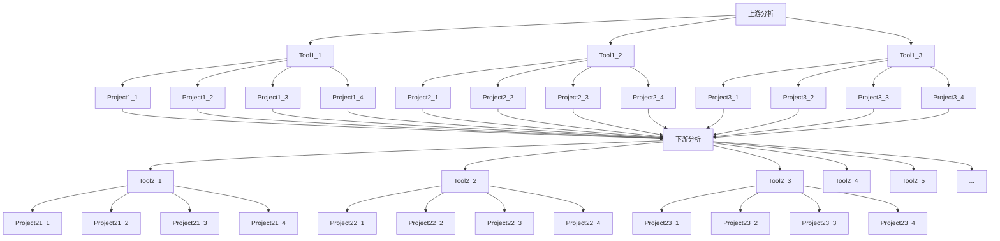

# Coding Style and Performance

## Introduction
當老師給你一個新的題目，可能是針對某些 gene 或 transcript 進行資料整理、統計分析、繪製圖表...。你可能心中有很多想法，並且躍躍欲試，然後寫出了你的第一個版本(A)。

| project.py |
| ------ |
| A |

過了幾週的 meeting，你被要求測試好幾種功能。為了開發方便，你可能複製了好幾個類似功能的 Jupyter Notebook block 或 function，程式碼越來越多，程式重複性也越來越高。

| project.py |
| ------ |
| A、B、C、D |

接著當你完成後，老師說要開始分析不同的資料，只要調整部分程式內容跟輸入就可以了吧？於是你把程式複製成更多的程式，每個都只改一點點。

| project1.py | project2.py | project3.py |
| ------ | ------ | ------ |
| A、B、C、D | A'、B'、C'、D' | A''、B''、C''、D'' |

當你完成後，老師說要將這個分析流程加上不同的分析工具，於是你將程式繼續擴充。

**Tool1:**
| project1_1.py | project1_2.py | project1_3.py |
| ------ | ------ | ------ |
| A、B、C、D | A'、B'、C'、D' | A''、B''、C''、D'' |

**Tool2:**
| project2_1.py | project2_2.py | project2_3.py |
| ------ | ------ | ------ |
| A、B、C、D | A'、B'、C'、D' | A''、B''、C''、D'' |

**Tool3:**
| project3_1.py | project3_2.py | project3_3.py |
| ------ | ------ | ------ |
| A、B、C、D | A'、B'、C'、D' | A''、B''、C''、D'' |

接著，你終於發現你只完成下游分析的其中一個環節，你還必須接著做其他環節，再將上游分析串起來。


然後，你突然發現原始功能 A 有 bug 要改。於是你開始著手從每一個檔案慢慢改。因為這是你寫的程式，所以 **「當下」** 你可能還改得動。

- 如果三個月後要你改呢？半年後呢？你真的知道你在寫什麼嗎？
- 如果你的下屆學弟妹要繼續接手你的研究，他有辦法改 code 嗎？
- **Spaghetti Code**


> 寫程式很容易，但是把程式寫好很困難

這個「好」可能是規格上、效能上、可讀性上、重複使用性上，在我們研究與開發的過程中，本來就很難一次到位。所以你必須時刻提醒自己，預先做好程式規劃與擴充的可能。

### <span style="color:#F75D59;">不要急著寫程式！</span>


寫程式容易犯的問題：**Long Method**、**Duplicated Code**

很多人喜歡將完整功能寫進同一個 method A，但常常造成程式碼冗長，難以閱讀與維護。未來如果要寫一個新的 method B，其部分功能與 method A 重複，可能會選擇直接複製 method A 的內容，或是直接呼叫 method A，造成程式重複性高、結構錯綜複雜。

### Don’t Repeat Yourself 

當一個 method 過長，通常代表他們由更基本的需求所組成。可以將它們重構成幾個低階的 method，比較容易從語意上理解高階 method 的運作，也較容易讓其他 method 重複利用。

例如：將資料分析中讀檔、運算、繪圖的功能分開

> 應該基於「設計意圖」，而不是基於「重複的表象」來重構程式碼

- 真正重複：當一個區塊的重複程式碼修改時，其他區塊相同的重複程式碼也需要進行修改。
- 假性重複：兩段看起來相似的重複程式碼，實際上各自擁有不同的改變原因與頻率，兩者會朝著不同方向演化。

例如：我在分析 transcript Start/Stop codon 分佈時，可能會做很多類似的圖（如下）。


雖然都是並排呈現的折線圖，但是上下四張彼此有著不同的作圖邏輯，未來也可能會進行不同的調整（增減資料、改軸距、改顏色...），如果硬是寫進同一個底層 method，參數會太多，使用不易且難以修改。

過度去重複會造成函式之間過度耦合（依賴性、相關性太高），使後續調整的彈性變低。

## 規格化

在寫程式前，先靜下心來想清楚：你需要什麼資料？想要達成什麼結果？

- 在軟體業，通常由雇主以抽象方式定義需求 (What)，但不事先定義解決的辦法 (How)
- 訂出的需求讓多家承包商參與競標，提出滿足需求的方案
- 一旦競標成功，就要提供更詳細的系統規格與驗證方式，產出 requirements document

### 需求種類
- 功能性需求：
    - 系統提供的服務、針對外界輸入的互動行為、例外狀況
- 非功能性需求：
    - 開發限制與標準、時間限制
    - eg. reliability、response time、storage requirements...
 
### 定義問題

可以在每一個函式前詳細註解其內容：
- 功能描述
- 輸入檔案與來源
- 輸出檔案與目的地
- 限制條件

> 建議可以多跟老師討論 project 的目的、願景、細節，設想它未來可能會需要什麼功能，才不會一直反覆施工

### PEP8 Coding Style

PEP 全名為「Python Enhancement Proposal」，就是官方對所謂 Pythonic 提出的一個建議書，細節可以 [參考這裡](https://peps.python.org/pep-0008/)。

PEP8 規範了一些基礎語法的建議，包含命名、函式宣告、判斷式，例如：
- 用四個空格進行來縮排
- 限制每行最多 79 字元
- import 要放在檔案的最上面，且盡量使用絕對路徑
- method 使用小寫命名，Model 使用大寫命名
```python=
from pkg import settings, models

LEN_FILTER = 10

def get_data():
    pass

class Transcript:
    pass
```

寫出符合標準的程式可以增進可讀性，方便交流。

Jupyter Notebook 與 VScode 都有 Auto PEP8 套件可以使用。


## 模組化

將你的複雜程式拆解成幾個主要功能（模組），再打造出幾個簡單、專一的小工具（函式）。

我們不希望一個程式同時能做到 A → B → C → D；我們希望能在任何時候呼叫 A、B、C、D 四支程式。

- **模組抽象化：**
    - 將程式依照功能進行拆分，即使還不確定如何實作，也能先決定功能的抽象表述方式（程式設計）
    - 在一些大型專案中，會先寫 pseudo code
- **資訊隱藏：**
    - 不讓模組外界碰觸不需碰觸的資訊、不讓它們知道不需知道的事情
    - 例如：資料庫 API
- **獨立性：**
    - 模組本身能夠做為一個獨立的單元，執行特定的工作，不和其他模組有太多複雜的關聯

### Python Module


- 模組 Module：
    - 一個 python 檔案就可以是一個 module，裡頭可以定義 variable、function、class
- 套件 Package：
    - 一個檔案資料夾，裡面存放多個 module (.py 檔案)
- 函式庫 Library：
    - 根據特定用途，將多個 Package 集合在一個資料夾中
- 應用程式介面 API：
    - 函式庫的開發者可定義哪些 module 中的 function 可以給別人使用，這些 function 就稱為 API
    - 對於外部使用者，不需要了解實作內容，只需要從說明文件閱讀 API 的使用方法

**範例(一)：** 讀入特定 python module (preprocessing.py):
```python=
from preprocessing import get_data, normalize

URL = "https://xxx..."

data = get_data(URL)
output = normalize(data)
```

**範例(二)：** 讀入特定 python package (pkg directory):
```python=
from pkg import preprocessing, analysis

URL = "https://xxx..."

data = preprocessing.get_data(URL)
norm_data = preprocessing.normalize(data)
output = analysis.mapping_mRNA(norm_data)
```

## 效能優化

效率的兩個面向：時間、空間

一般來說，時間與空間是互相 trade off，例如 Bucket Sort 與 Bubble Sort。

從使用者的角度來說，通常不會知道後台做了什麼事、用了多少空間，再加上現在硬碟很便宜，所以我們通常比較關注時間效率。

### 記憶體讀寫方式

在傳統 C 語言中，如果我們要宣告一組新陣列，必須先宣告「固定記憶體長度」的 array，也就是它的資料型態與大小，不能任意轉換。

在 Python 語言中，我們可以簡單利用 list，宣告一些不定長度的指標（pointer），指向記憶體中任何我們新增的資料，所以型態、大小都可以變動。

List 非常靈活，但是效能極差；Numpy 是基於 array 的架構，所以效能很好但不靈活；Pandas 則是 Numpy 的變形，用得好的話效能也是絕佳。


- 範例：
```python=
# 動態獲取記憶體
lst = []
for i in index:
    lst.append(data[i])

# 事先宣告記憶體，再直接指定數值
array = np.empty(len(index), dtype="uint8")
for i in index:
    array[i] = data[i]
```
- 不同資料型態所佔的空間：

- 建議在遇到大數據時，少用 List，多用 Numpy 宣告與操作陣列
- 嚴格定義資料型態，最佳化記憶體大小


### 時間複雜度

當我們執行一支程式，每一次時脈，只能做一次運算。想要加快程式執行的速度，你可以買更好的 CPU，或是設計更好的演算法 (Algorithm)。

時間複雜度 (Time Complexity) 是指程式「執行時間」隨著「數據規模」增長的趨勢，通常記作 O()。

衡量時間複雜度，通常取程式裡最複雜的部分，省去尾數。

- O(1)：簡單指令
- O(log n)：binary search
- O(n)：loop
- O(n<sup>k</sup>)：nested loop


### <span style="color:#F75D59;">站在巨人的肩膀上！</span>

1. 建議少用 for 迴圈修改數據，多利用 DataFrame 整體特性
- 範例：
    ```python
    # 整欄的操作
    df['length'] = df['end_pos'] - df['init_pos'] + 1

    # 條件下的操作
    df.loc[ df['read_pos'] > df['ref_pos'], 'read_pos'] = df['ref_pos']
    ```
2. 建議少用 for 迴圈整合資料，多用 Pandas 內建函式
- **[Merge](https://pandas.pydata.org/docs/user_guide/merging.html)：** 類似文式圖，可以用 inner、outer、right、left，不需要慢慢找值
    - 範例：整合 hybrid read 與 reference 上的資料
    ```python
    df = pd.merge(read_df, ref_df, how='inner', on='column')
    ```    
- **[Groupby](https://pandas.pydata.org/docs/user_guide/groupby.html)：** 將某個 column 作為 index 重新整理資料
    - 範例：整理不同 gene 上的 transcript
    ```python
    #     gene trans
    # 0   A    1
    # 1   A    2
    # 2   B    3
    # 3   B    4
    # 4   B    5
    # 5   C    6
    
    df.groupby('gene')['trans'].apply(list)
    
    # gene
    # A   [1, 2]
    # B   [3, 4, 5]
    # C   [6]
    ```
- **[Pivot Table](https://pandas.pydata.org/docs/user_guide/reshaping.html)：** 重構 dataframe 的 index, columns, values
    - 範例：計算 transcript 重複次數，常用於分配 read count
    ```python
    # 以下兩種結果等效
    df.groupby('gene')['trans'].count()
    df.pivot_table(index=['gene'], aggfunc='size')
    
    # gene
    # A    2
    # B    3
    # C    1
    ```

## 驗證

為了避免個人的程式邏輯錯誤，導致研究結果出現瑕疵，我們實驗室習慣由第二個人寫一份同樣的程式來互相驗證。

有時會套幾個簡單的例子（頭尾、中位數、隨機）進行測試，然而這是「不保險」的做法，因為特例經常存在我們意料之外的地方。

- [Excel 在數據科學上的謬誤](https://genomebiology.biomedcentral.com/articles/10.1186/s13059-016-1044-7)


### Pandas 

Pandas [equals()](https://pandas.pydata.org/docs/reference/api/pandas.DataFrame.equals.html) 可以最快速幫助我們判斷兩個 DataFrame 是否一致，前提是資料格式必須調整一樣。

```python
df1.equals(df2) # return True or False
```

equals() 無法詳細描述不同之處，雖然可以搭配 Pandas [compare()](https://pandas.pydata.org/docs/reference/api/pandas.DataFrame.compare.html) 列出細節，但稍嫌難用。

### difflib

可以用來比較兩個 string、list 的不同，搭配 readlines() 可以比較兩個檔案內容的不同。

可以判斷出 mismatch、deletion 的情況，詳情參考 [官方文件](https://docs.python.org/3/library/difflib.html)。


### 客製化測試
有時候，雖然兩邊資料不一致，但在邏輯上應該要視為一樣。

- [Python 在浮點數運算上的限制](https://docs.python.org/zh-tw/3/tutorial/floatingpoint.html)

```python
(0.1 + 0.1) == 0.2        # True
(0.1 + 0.1 + 0.1) == 0.3  # False
```
可以自己寫測試程式，將資料先處理後再進行比對。

- 四捨五入：round()
- 無條件進位：math.ceil() 
- 無條件捨去：math.floor()


## Exercise
- 請試著計算作業中每個步驟花費的時間
- 請試著比較不同作法，有沒有更好？
