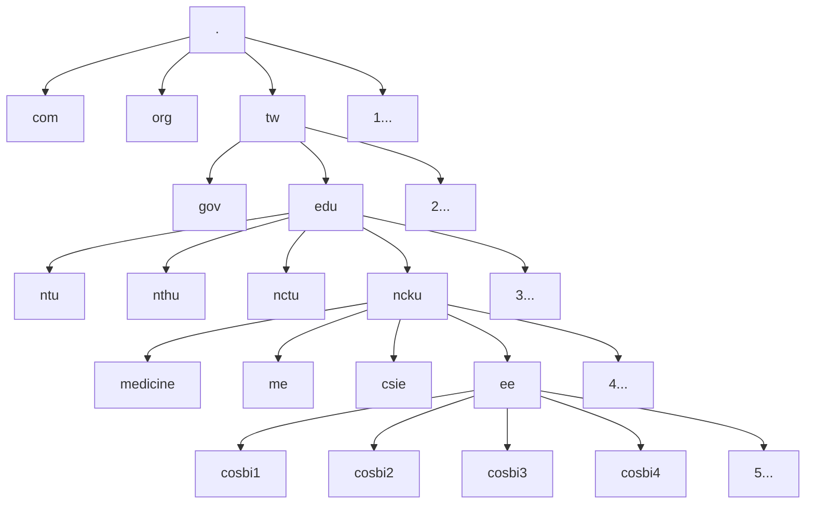

# Web Basic

## 網站基礎

在開始之前，我們先來認識網站基礎架構。


首先，網站一般可分為「前端」與「後端」，前端是一般使用者透過瀏覽器（Chrome、Safari、Firefox...）或 APP 所看到的各種資料與美麗頁面。一般網頁前端工程師與設計師即是在滿足所需功能的前提下，努力將頁面做得美美的。

至於後端則是負責連接伺服器 (Server) 與資料庫 (Database) 的地方，有時候還需要整合前端功能，進行後台的各種資料運算、分析，再將處理好的資訊送去給前端渲染 (render)，讓一般使用者能看到結果。

Server 的架設可以使用一些軟體諸如 Apache、Nginx、Express，架在自己的主機或虛擬主機商提供的平台上。通常小型企業比較喜歡使用虛擬主機商的服務，例如 AWS、Azure、GCP，省去自行維護硬體的困擾；研究機關與大型企業則偏好自己架設伺服器，像我們實驗室有七台工作站，每台都有一個固定 IP 與對應的網域名，讓外界可以連上工作站的網站。

當使用者透過瀏覽器連接某個網址，其實是丟一個 request 給 Server 上的後端程式，後端則會根據需求回傳一個前端網頁，這樣瀏覽器就能接收並解讀成頁面資訊。


例如，如果我們連上實驗室的網頁工具： **pirScan** (http://cosbi4.ee.ncku.edu.tw/pirScan/)，即是透過 http 協定，連結到「cosbi4.ee.ncku.edu.tw」這個網域中的「pirScan」這個路徑。Apache 後端會根據設定，去路徑中抓相對應的 HTML 頁面，回傳給瀏覽器看。

### DNS

網域名稱系統 (Domain Name System，簡稱 DNS)，指的是將 IP 位址與網域名進行對應的方式。因為一般使用者很難記住由純數字構成的 IP 位址（如 140.116.214.133），所以需要賦予它一個有意義的名字（如 cosbi4.ee.ncku.edu.tw），這樣才好辨識。

當我們使用 cosbi4.ee.ncku.edu.tw 進行網路連線，瀏覽器會去詢問預設的 DNS Server 這個名字對應到哪台主機？DNS Server 回傳 IP = 140.116.214.133，瀏覽器才知道要連線至這台主機。

通常我們習慣使用 Google Public DNS，也就是 8.8.8.8。當然，你也可以使用成大自己的 DNS Server：163.28.112.1。



DNS Server 是層層相連的，如果今天要連線 cosbi4.ee.ncku.edu.tw，就會先去拜訪 tw（台灣），tw 給出 edu（教育機構）的地址，就可以進一步找到 ncku（成大）的地址，ncku 再給出 ee（電機系）的地址，最後電機系的 DNS Server 再給出 cosbi4 (140.116.214.133) 這個絕對座標。

如果我們使用自己的電腦架設網站，可能只會有諸如：http://140.116.214.150/website 這種網址，想要有 Domain Name，需要跟你的上級機關註冊（也就是實驗室網域名需要跟電機系註冊），或是自行購買網域名，例如 [GoDaddy](https://tw.godaddy.com)、[HiNet](https://domain.hinet.net/)。


### 靜態與動態網站

以上種種稱之為「靜態網站」。使用者只是丟網址，伺服器則是回傳內容，沒有更進一步的互動，基本上可視為資料連結而已。但如果是一個數據分析網站，當使用者上傳一個檔案，後端將其運算、分析後再傳回前端，這就涉及到前後端的即時互動，稱之為「動態網站」。

後端語言有很多種，像是 PHP、Perl、Ruby、Node.js、Python...，各有各的特色與適用範圍，甚至你要用 C 語言寫後端都沒問題。但目前比較常見的作法，是透過適當的網站框架 (web framework)，將前後端整合起來，再透過某些內容管理系統 (content manager system, CMS) 來降低後端維護的難度。

我們實驗室目前主要使用以 Python 為後端的網站框架 Django，將會於下個單元進一步作介紹。本週先著重在靜態網頁的語法。

如果要查看靜態網頁的成果，只需用瀏覽器打開 HTML 檔案即可；但若是要發佈到網際網路上讓外人連線，就需要架設伺服器。你可以考慮使用前文提及的各種辦法，或是簡單利用 Github Pages 的功能，例如本次暑期教學的 [主網頁](https://ryanccj.github.io/2022_Lab_Training/)。

## 網頁語法

前端網頁由三大要素構成： **HTML、CSS、JavaScript** 。


在傳統觀念中，HTML 就像是網頁的骨架，負責規劃整體架構與內文；CSS 就像是外皮，負責美化網頁的外觀，包含排版、字體、顏色等等；JavaScript 就像是靈魂，負責讓網頁跟使用者互動，甚至串接後端程式與資料庫。

因為 JavaScript 具有相對完整的功能與社群，在現代設計中，常常會透過前端 JavaScript 框架來達到更複雜且有效率的互動模式，以用戶端渲染（client-side rendering）的方式取代原本純由 HTML 建構的骨架。

所有網頁基礎語法都可以去 [W3Schools](https://www.w3schools.com) 、[CodePen](https://codepen.io) 練習，至於前端框架的使用，則會加開一堂課做介紹。

### HTML

超文本標記語言（HyperText Markup Language，簡稱 HTML）是網頁最重要的部分，也就是架構與內文。

超文本（HyperText）是指含有超連結的文字，透過超連結將 world wide web (WWW) 上無數的網頁彼此相連；標記語言（Markup Language）是指透過許多標籤（tag）框出特定的文字內容，藉此標記它們的特性，例如結構、大小寫、表格、圖片、連結等等，通常會用「<...>」與「<.../>」作為開頭跟結尾。

#### 基本標籤
- `<!DOCTYPE html>`
    宣告文件為 HTML 形式
- `<html>`
    網頁的根元素（root element）
- `<head>`
    網頁的資訊，包含 CSS、JS 檔案的網址，內容不會顯示在頁面上
- `<body>`
    網頁的主要內容，所有在畫面看得到的元素都放在裡面

```htmlembedded
<!DOCTYPE html>
<html>
    <head>
        <!-- 宣告該頁面的編碼方式 -->
        <meta charset="utf-8"> 

        <!-- 行動裝置的顯示方式，initial-scale=1 代表不縮放 -->
        <meta name="viewport" content="width=device-width, initial-scale=1">

        <!-- 在瀏覽器 tab 標籤上的小圖示 -->
        <link rel="icon" href="favicon.png">

        <!-- 連接 main.css -->
        <link rel="stylesheet" href="main.css">

        <!-- 連接 main.js -->
        <script src="main.js"></script>

        <!-- 在瀏覽器 tab 標籤上的標題 -->
        <title>網頁標題</title>
    </head>
    <body>
        網頁內容...
    </body>
</html>
```

#### 區塊標籤


- `<main>` 主要內容
- `<header>` 網頁標頭，經常包含 logo、標題、導航列
- `<nav>` 導航列
- `<article>` 主要文章
- `<section>` 段落
- `<aside>` 跟主要內文沒有太直接關係的側欄、廣告
- `<footer>` 網頁結尾，經常包含版權資訊、聯絡方式

#### 其他標籤
- `<div>`、`<span>` 分組用，通常用來區分結構與屬性
- `<h1>`～`<h6>` 網頁標題
- `<p>` 文字段落（paragraph）
- `<a>` 超連結或錨點
- `<ul>`、`<li>` 清單
- `<table>`、`<tr>`、`<td>` 表格
- `` 圖片
- `<br>` 換行
- `<hr>` 分隔線
- `<!-- -->` 註解

#### 屬性
- `class` 標記多個類似的標籤
- `id` 標記特定的標籤

```htmlembedded
<div class="container">
    <div class="row">
        <div class="col" id="col_1">
            One of three columns
        </div>
        <div class="col" id="col_2">
            One of three columns
        </div>
        <div class="col" id="col_3">
            One of three columns
        </div>
    </div>
</div>
```
- `src`、`href` 檔案連結或錨點

### CSS
階層式樣式表（Cascading Style Sheets，簡稱 CSS），是一種用來為結構化文件（如 HTML）添加樣式的語言，可參考 [W3Schools 範例](https://www.w3schools.com/css/css_intro.asp)。


```css=
h1, h2, p {
  text-align: center;
  color: red;
}

.container, .row {
    
}

#col_1, #col_2 {
  color: blue;
}
```

另一種插入 CSS 的方式是直接將 `style` 寫入 HTML 標籤或屬性內，如以下兩個範例。
- **範例(一)：**

```htmlembedded=
<!DOCTYPE html>
<html>
<head>
    <style>
    h1 {
      text-align: center;
      color: blue;
    }

    p {
      color: red;
    } 
    </style>
</head>
<body>
    <h1>This is a heading</h1>
    <p>This is a paragraph.</p>
</body>
</html>
```

- **範例(二)：**
```htmlembedded
<h1 style="text-align:center; color:blue;">This is a heading</h1>
<p style="color:red;">This is a paragraph.</p>
```
然而為了避免 HTML 內存在過多要素，我們比較推薦將 CSS 檔案獨立出來（檔案模組化）。

### JavaScript

JavaScript 是一種為了擴充 HTML 功能所開發的程式語言，基本上與 Java 完全沒有關係（容易使人誤解）。它可以用來整合非常多套件，且支援物件導向語法，長年以來盤踞最熱門的語言前幾名。


如同 CSS ，JavaScript 也可以透過標籤直接插入 HTML 如下：
```htmlembedded
<script>
var x = a + b;
</script>
```
然而為了避免 HTML 內存在過多要素，我們比較推薦將 JavaScript 檔案獨立出來（檔案模組化）。

#### 註解
```javascript=
// 單行註解

/* 
多行註解
...
...
*/
```
#### 基本語法
不同於 Python，變數使用必須先宣告。如果變數宣告時沒有給定數值，那麼資料會是 `undefined`。

- `var` 全域變數
- `let` 區域變數
- `const` 區域變數（不可改值）

邏輯使用上如同 Python，也會有 if-else、for-loop、try-catch 等，但是多了些其他語言會有的語法，像是 switch。

#### 輸出
不同於一般程式，我們是用瀏覽器觀察 JavaScript 的輸出結果，所以不能使用 print()。可以配合 Chrome DevTools，使用 console.log()。

#### Function
JavaScript 也可以編寫函式，並且將它作為物件。
- 一般語法：
```javascript
function add(x, y) {
  return x + y;
}

var add = function(x, y) {
  return x + y;
}
```
- Arrow Function (ES6 版本開始支援)：
```javascript
var add = (x, y) => x + y;
```

#### DOM
Document Object Model 是一種結構化存取文件內物件的方式。


- **範例(一)：** 修改所有 col 內的內容
```javascript
document.getElementByClassName("col").innerHTML = "hello world";
```
- **範例(二)：** 新增 btn_1 的觸發事件
```javascript
var x = document.getElementById("btn_1");
x.addEventListener("click", () => {
  alert ("Hello World!");
});
```


如果你已經練習過大部分的功能，甚至開始寫一些簡單的網頁，推薦可以閱讀這篇文章：[重新介紹 JavaScript](https://developer.mozilla.org/zh-TW/docs/Web/JavaScript/A_re-introduction_to_JavaScript)。

## Exercise
- 請自行去 W3schools 閱讀並練習 HTML、CSS、JavaScript 語法。
- 請產生一個自我介紹頁面，至少包含一張圖片、社群連結、三個動畫效果。
