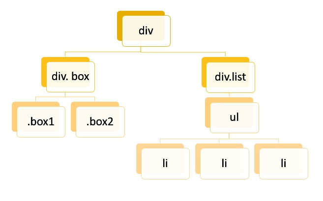
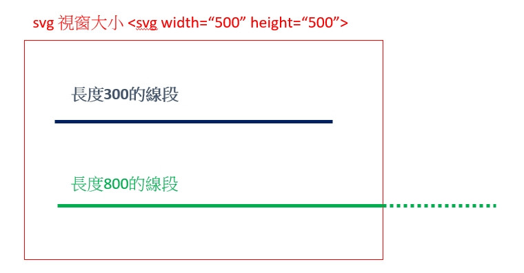
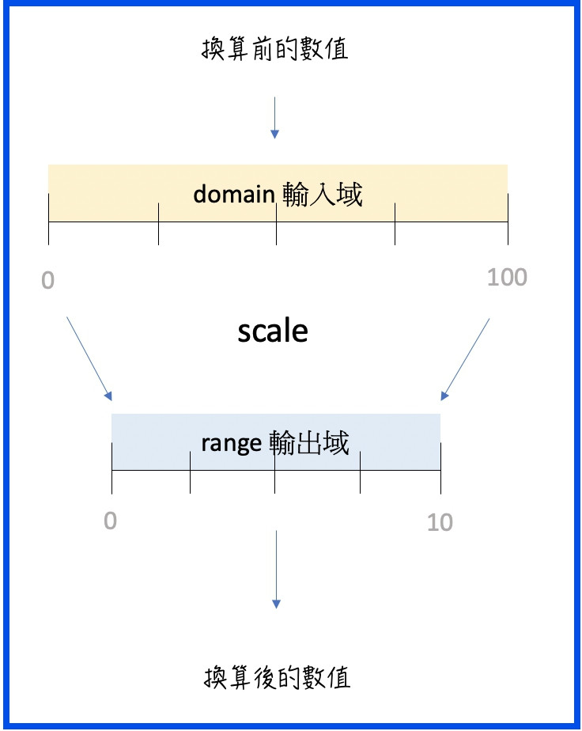
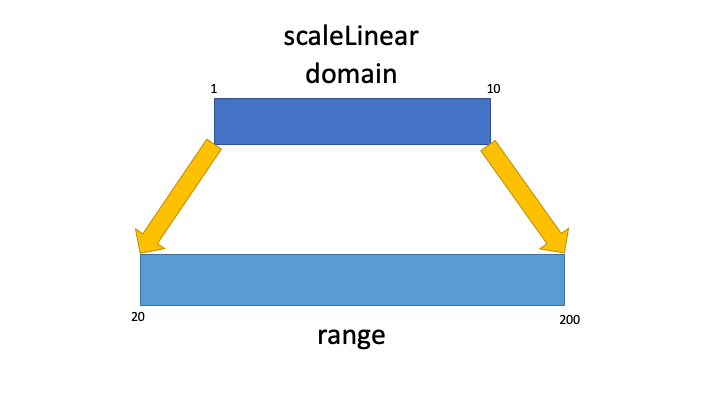
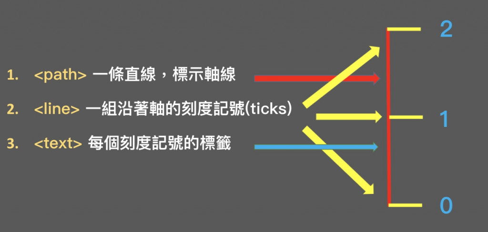
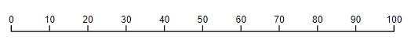
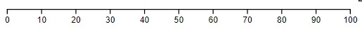
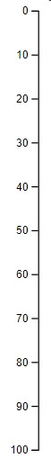
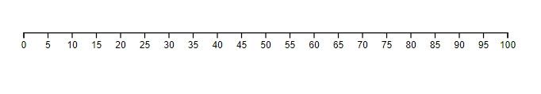

# D3.js

## 簡介
### 為什麼使用D3.js


* **優點**：
    1. **自由度高**，能建立各式互動圖表
    2. SVG 也是DOM 之一，包含許多 DOM 的互動 (hover、mouseover)，可以製作**更精確的使用者互動**
* **難點**：
    1. **內建多種 API** ，需要了解許多**基本技術**：DOM、CSS selection、 JS Object 、SVG
    2. **版本迭代快**，新版的資源少
    3. D3.js 的[官網](https://d3js.org)入門教學對新手不直覺


### 版本變化

第3版 (v3) 是最多人分享教學、範例程式碼、酷炫圖表使用的版本，因此現在網路上一查還是很多程式碼都是用 v3 寫的。但如果傻傻想直接套用網路上查到的程式碼，很可能根本跑不動。而且目前D3已經出到第七版(v7)了，但很多中文的教學資源卻停留在v5。

要特別注意的是第3版 (v3) 跟 第4版 (v4) 差異巨大，很多底層撰寫的方式都改掉了。因此直接把第三版的程式碼拿來用的話，你連圖片都看不到，眼前只有一片空白。


### D3 基本介紹與運作原理

D3.js 是一套 JS 函式庫，能用來操作 Document Object Model (DOM) 樹狀資料，將資料內容視覺化的工具。D3.js 全名是 Data-Driven Documents (資料驅動文件)，這三個 D 也是 D3 的由來。

#### DOM
D3 是靠著操作 DOM 元素來進行 node 節點增減，再透過 SVG 去渲染圖表
DOM 的全名是 Document Object Model，中文叫做文件物件模型。，就是把 HTML 文件中的每個標籤都定義成物件，最後這些物件會形成像是樹狀的結構。



#### SVG
有了以上的 DOM 概念後，我們就可以來看SVG啦！SVG 的全名是 Scale Vector Graphics (可縮放向量圖型)，是以 XML 文字檔來建立 2D 的向量圖形，因此開發者可以直接在 HTML 檔案中使用 SVG，而且也支援動畫跟互動的操作。

SVG 圖形可以有不同的形式

-   獨立的文件 ⇒ 比較少見
-   ==包在 HTML 檔案中 ⇒ 最常見，為 < svg > < /svg >元素==
-   當作圖片來源引入 ⇒ < img src="smile.svg" >

```html
<svg width="500" height="500"> 這邊放入要繪製的圖形元素標籤... </svg>
```
1.  SVG 是`基於 XML 文字檔格式，產生DOM樹` (不像canvas是平面畫布)
    
2.  SVG `定義了一系列圖形元素`，例如「圓或矩形等基本形狀、文字、直線、曲線」等等，然後`再透過外觀屬性去改變這些形狀的尺寸、位置、顏色等等`。
3.  跟一般的 html 撰寫一樣，SVG 也是按照文件的順序進行渲染，所以`後來寫的元素會遮蓋掉先前出現的元素`
4.  SVG 使用的是圖形座標，因此`原點是左上角`，由上而下、從左至右
5.  SVG 可以接收使用者事件，並`回應事件進行互動`
6.  SVG 圖形`原則上是無限大`，width / height 只是定義 viewport (可視範圍)。  
    **這點很重要，正因為 svg 圖形原則上是無限大，所以如果圖案超過 svg 的可視範圍，圖案一樣存在只是我們看不到而已**



### select 選擇器
我們使用 d3.select 的 API 時，它會回傳一個集合物件（這邊通稱為 selection）。這個集合內可能有元素，也可能沒有元素 (是一個空集合)。而這個集合物件之後在資料綁定的過程，會透過 enter/exit 來決定實際上的節點數量

-   `d3.select`：選取符合欲選元素的第一個元素
-   `d3.selectAll`：選取符合欲選元素的所有元素

選定元素之後，我們可以透過 d3.selection 提供的一些方法，來對選到的元素進行樣式、屬性的調整

-   `selection.style()` 調整樣式
-   `selection.attr()` 調整標籤屬性值


### 資料綁定
綁定資料的 API 歸類於 selection 分類之下，==這是因為我們要先用 d3.select 的方法選定DOM節點後，才能將資料綁定到 d3.select 回傳的 selection 實體上，並對資料跟元素的配對與增減進行對應處理。==

先用 d3.selection 選定節點，才能用.data()去綁定資料！

1.  `綁定DOM元素跟資料的方法`
    
    -   selection.data( )
    -   selection.datum( )
2.  `增減資料數量與DOM元素不匹配的方法`
    
    -   selection.join( )
    -   selection.enter( )
    -   selection.exit( )

#### selection.data

1. 當資料陣列跟 DOM 元素綁定時，會按照 index 的順序將資料一一綁定到DOM元素上。這時單一個 data 就會被存在匹配的單一個DOM元素 ＿data＿ 這個屬性中，並達成讓元素與 DOM「黏」在一起的效果
2. 如果想綁定多個元素跟數值的話也可以，但就要改成secectAll 來選定 DOM 元素

### Scale( ) 比例尺
==svg 理論上是無限大的，它所設定的 width 跟 height 其實只是 viewport (視窗範圍)==。所以，即使我們的數據資料超過 svg 的 viewport，它一樣會存在跟繪製，只是我們看不到而已。

D3 的 scale 方法是==將資料(通常為陣列)轉換成視覺變量(visual variables)，例如：位置、長度、顏色等等==，這樣一來我們才能使用視覺變量把資料視覺化。舉例而言，scale 可以把資料轉換成以下幾種視覺變量：

-   轉換成長度 ⇒ 以供長條圖來設定長度
-   轉換成位置 ⇒ 以供折線圖來設定位置
-   把百分比資料轉換成連續數值 ⇒ 以供設定顏色的範圍
-   把時間資料轉換成位置 ⇒ 以供軸線使用

#### domain & range 
-   **`Domain 輸入域`**是在進行比例尺**換算前**，資料的整個數值範圍
-   **`Range 輸出域`**則是進行比例尺**換算後**，得到換算之後的資料數值範圍



```javascript
// 輸入與輸出比例換算範例   
const convert = d3.scaleLinear() 
		   .domain([0, 100]) 
		   .range([0, 10]) 
console.log(convert(50)); // 5，換算輸出比例完成
```
#### D3 scale 比例尺分類

D3 的官方文件將比例尺分成五種，分別是

**Continuous Scale 連續性比例尺
Sequential Scale 序列比例尺
Diverging Scale 發散比例尺
Quantize Scale 量化比例尺
Ordinal Scale 次序/序位比例尺**

但若按照輸入與輸出的資料來分類，這五類比例尺又可以被歸納為三大類：

「連續性資料輸入」與「連續性資料輸出」的比例尺
包含 Continuous Scale、Sequential Scale、Diverging Scale

「連續性資料輸入」與「離散性資料輸出」的比例尺
包含Quantize Scale

「離散性資料輸出」與「離散性資料輸出」的比例尺
包含 Ordinal Scale

#### **Continuous Scale 連續性比例尺**
連續性比例尺可以把連續的、定量的 domain (輸入域) 映射到連續的 range (輸出域)。

不過連續性比例尺只是大分類，不能直接使用，我們要使用它旗下的比例尺方法來進行操作，它旗下的方法包含：

-   scaleLinear 線性比例尺
-   scalePow 冪比例尺
-   scaleLog 對數比例尺
-   scaleIdentity 恆等比例尺
-   scaleRadial 放射比例尺
-   scaleTime 時間比例尺


#### ★ d3.scaleLinear
線性比例尺是畫圖表時最常用到的比例尺，它最適合將資料轉換成**位置或長度**

線性比例尺的 domain 跟 range 都必須是連續性資料，而且由於是連續性資料，因此`可以用陣列帶入最小值與最大值`即可

```javascript
let linearScale = d3.scaleLinear()
                  .domain([0, 100])
                  .range([0, 50]);

linearScale(0);   // return 0
linearScale(50);   // returns 25
linearScale(100);  // returns 50
```


除了轉換長度跟位置之外，線性比例尺也可以用來**換算顏色的色度**

```jsx
const colorScale = d3.scaleLinear()
                    .domain([0, 10])
                    .range(['yellow', 'red']);

colorScale(0);   // returns "rgb(255, 255, 0)"
colorScale(5);   // returns "rgb(255, 128, 0)"
colorScale(10);  // returns "rgb(255, 0, 0)"
```

### Axis( ) & ticks( ) 軸線與刻度

圖表的座標軸其實是一個複雜的結構，一條座標軸包含了

-   `< path >` 一條直線，標示軸線
-   `< line >` 一組沿著軸的刻度記號(ticks)
-   `< text >` 每個刻度記號的標籤



因為 svg 都是從左上方的原點由上往下繪製。如果想要把軸線左右留點空間、移到下方的位置，我們就要 `margin` 跟 `transform` 來進行一些設定。

#### 刻度位置

這四個 API 之所以又分成 Top、Bottom、Right、Left 四種，只是因為生成的 ticks 方向不同~

-   **axisTop** ⇒ ticks 刻度在軸線上方  
    
    
-   **axisBottom** ⇒ ticks 刻度在軸線下方  
    
    
-   **axisRight** ⇒ ticks 刻度在軸線右方  
    
    
-   **axisLeft** ⇒ ticks 刻度在軸線左方  
    

#### ticks 刻度

##### axis.ticks( ) => 調整ticks數量

這個方法可以讓我們自行調整刻度的數量。

```jsx
let scale = d3.scaleLinear().domain([0, 100]).range([0, 500]);

let axis = d3.axisBottom(scale);

axis.ticks(20);

d3.select('svg g')
  .call(axis);

```


但要注意的是，即使我們定義好想要的特定刻度數量，如果刻度的值並非完整的數值的話，D3會自行調整刻度數量，讓 ticks value 是漂亮的數字 (例如以5為單位間隔)，例如：

```jsx
let scale = d3.scaleLinear().domain([0, 100]).range([0, 500]);

let axis = d3.axisBottom(scale);

axis.ticks(27); // 改成要27個ticks

d3.select('svg g')
  .call(axis);

```

出來的結果是一樣的  


## 補充資料

<!-- https://ithelp.ithome.com.tw/users/20134930/ironman/4181 -->
https://observablehq.com/explore
https://d3-graph-gallery.com/index.html