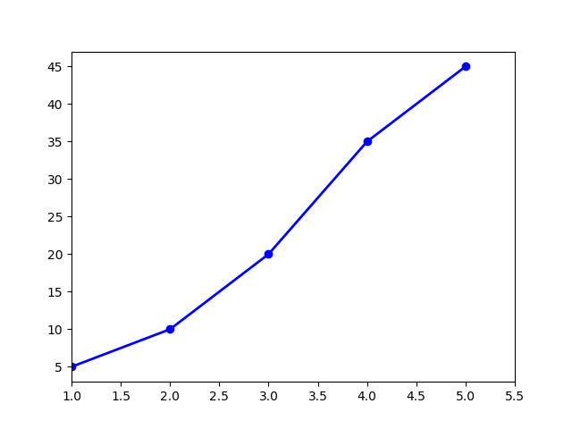
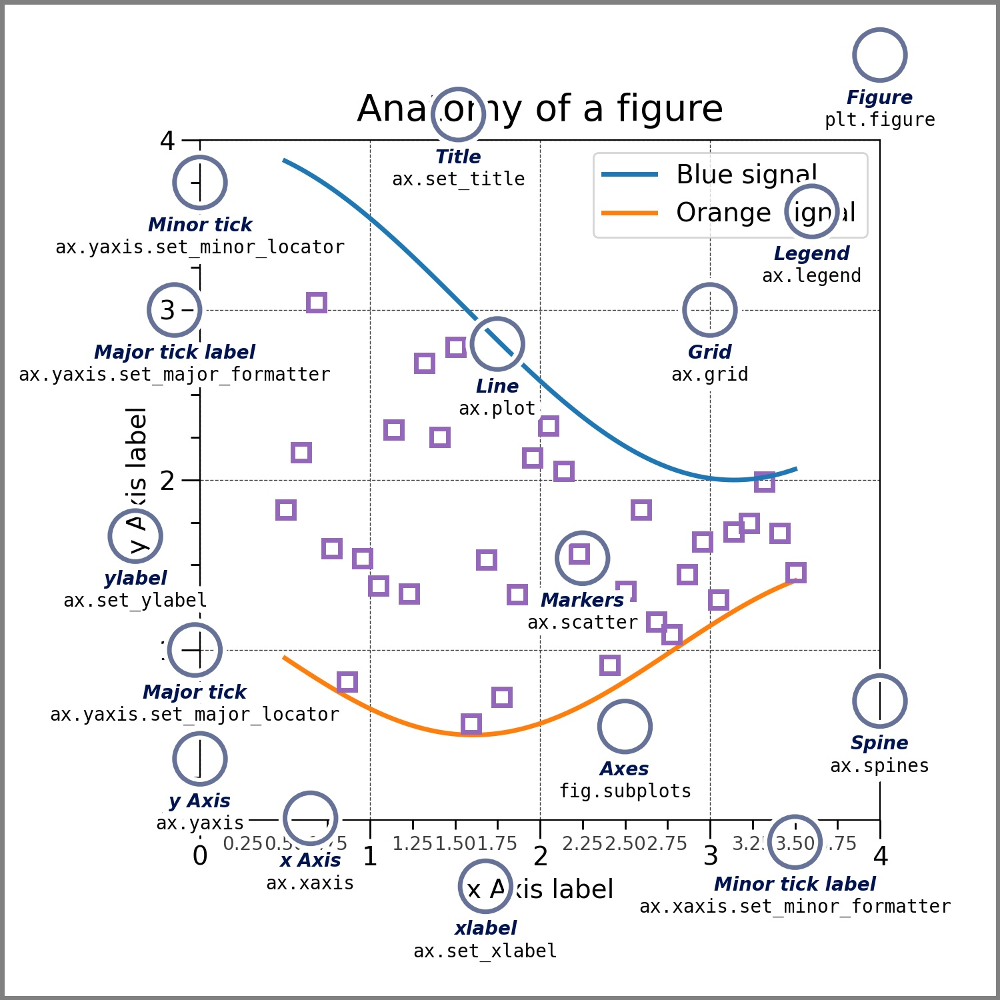
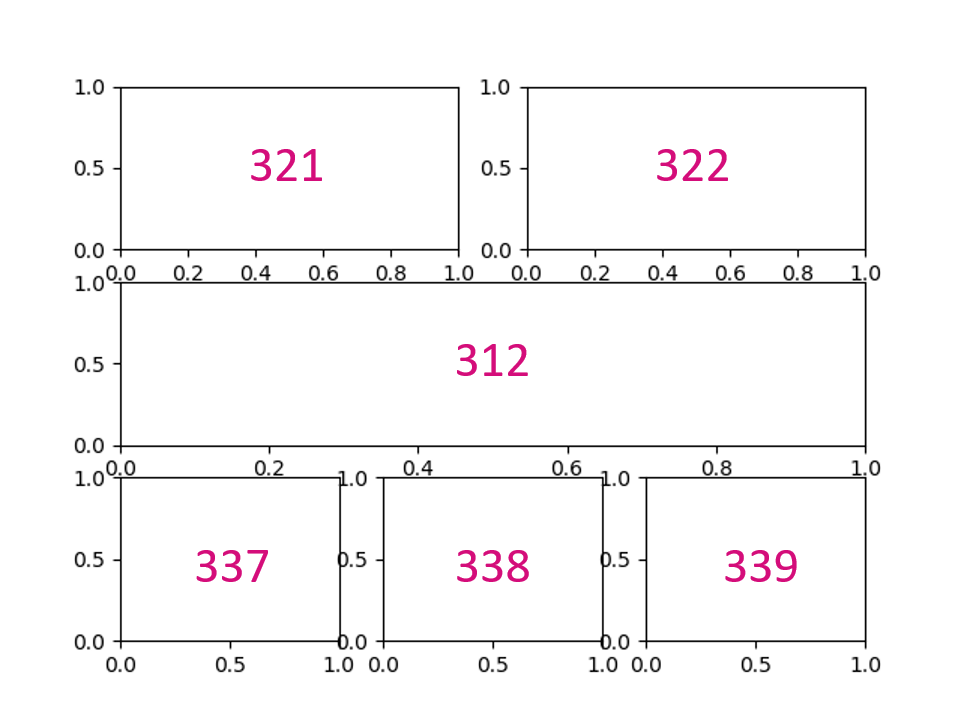
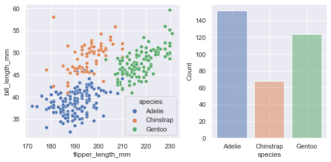
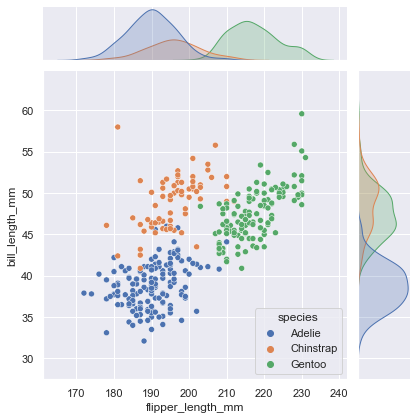
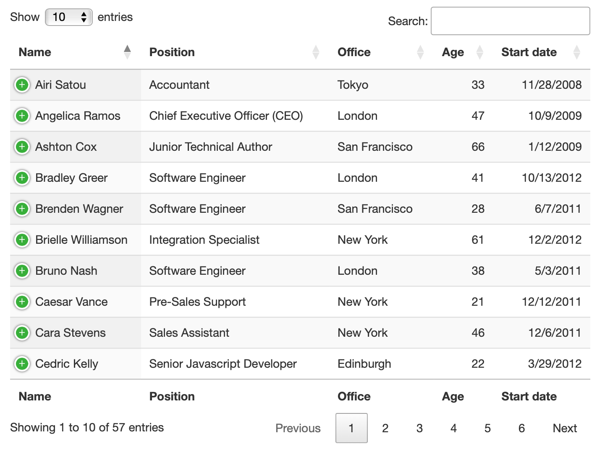
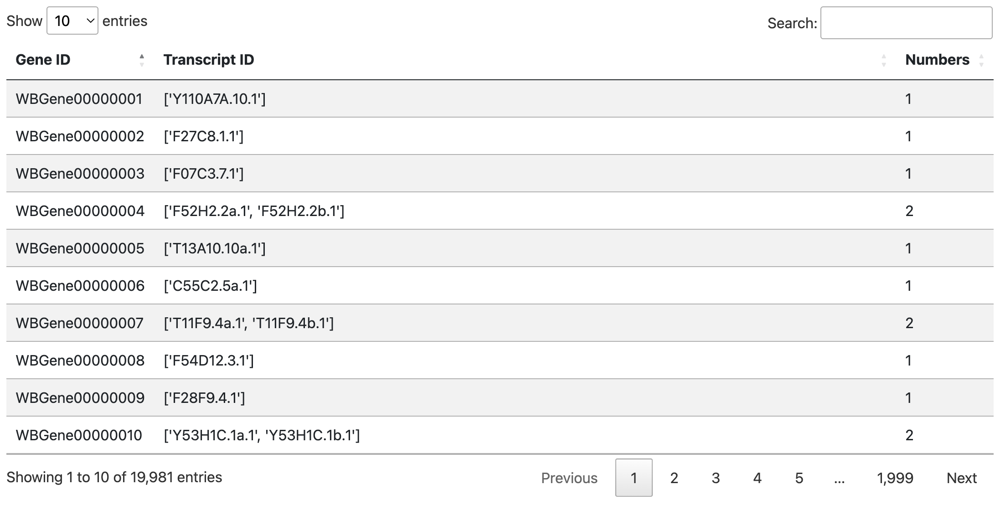
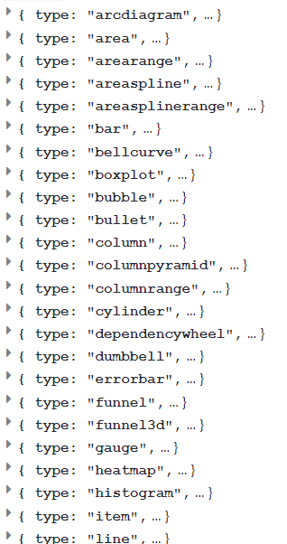
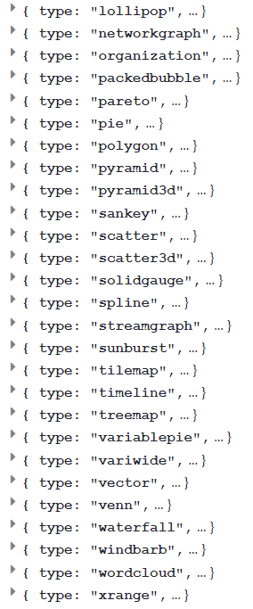
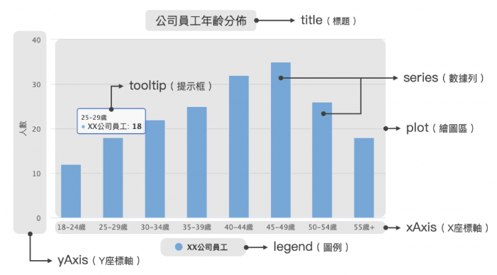

# Lesson 5. Data Visualization

資料視覺化是藉助於圖形化手段，有效的傳遞資訊。有效的視覺化可以幫助使用者分析和推理資料，使複雜的資料更容易理解與運用。

## Matplotlib

[Matplotlib](https://matplotlib.org/stable/index.html) 是 Pyhton 最常使用的靜態繪圖套件，我們常使用它繪製基本的直方圖與折線圖。可以透過 pip 安裝：
```bash
$ pip install matplotlib
```
用 Matplotlib 創建新圖時，可參考以下步驟及範例：
1. Prepare Data
2. Create Plot
3. Plot
4. Customize Plot
5. Save/Show Plot

```python
import matplotlib.pyplot as plt

# Step 1
x = [1, 2, 3, 4, 5]           
y = [5, 10, 20, 35, 45]  

# Step 2
fig = plt.figure()

# Step 3 & 4    
plt.plot(x, y, color='blue', linewidth=2, marker='o')
plt.xlim(1, 5.5)  

# Step 5
plt.savefig('test.png')   

# Step 6
plt.show()                    
```




在 Step 2 中，我們首先產生一張空畫布 figure；在 Step 3 & 4 中，我們使用 plt 套件在畫布上繪圖。除了上述範例，Matplotlib 還能針對圖表中許多細節進行調整，舉例如下：



有時候，我們會需要一次並列很多圖片，這時我們可以在畫布上創造許多子圖片 subplot，其位置是透過行、列、編號來定位。

```python
fig = plt.figure()

ax1 = fig.add_subplot(321)
ax2 = fig.add_subplot(322)
ax3 = fig.add_subplot(312)
ax4 = fig.add_subplot(337)
ax5 = fig.add_subplot(338)
ax6 = fig.add_subplot(339)

plt.show()
```



之後我們就可以針對每張子圖片繪製座標與圖表資料，舉例如下：
```python
fig = plt.figure(figsize=(20,20), dpi=100)
ax = fig.add_subplot(n1, n2, n3)
ax.plot(x, y, label=data+'AVG (+/- 1STE)', color='green')
ax.plot(x, y1, '--', color='green')
ax.plot(x, y2, '--', color='green')
ax.fill_between(x, y1, y2, color='green', alpha=0.3)
ax.set_title(target+'_STOP100 codon')
ax.legend(bbox_to_anchor=(1.05,0.8), loc='upper left')
```


## Seaborn

[Seaborn](https://seaborn.pydata.org) 是以 Matplotlib 為基礎的高階函式庫。相較於前者，其預設圖形更好看、語法更簡潔。如果要使用，一樣可以透過 pip 安裝：
```python
pip install seaborn
```
Seaborn 有一些預設 [資料集](https://github.com/mwaskom/seaborn-data) 可以練習，我們以「penguins」為例：


```python
import matplotlib.pyplot as plt
import seaborn as sns

penguins = sns.load_dataset("penguins") #dataframe

fig, axs = plt.subplots(1, 2, figsize=(8, 4), gridspec_kw=dict(width_ratios=[4, 3]))

sns.scatterplot(data=penguins, x="flipper_length_mm", y="bill_length_mm", hue="species", ax=axs[0])
sns.histplot(data=penguins, x="species", hue="species", shrink=0.8, legend=False, ax=axs[1])

fig.tight_layout()
```




使用高階函式庫，可以幫助我們迅速畫出複雜的視覺化圖表：
```python
sns.jointplot(data=penguins, x="flipper_length_mm", y="bill_length_mm", hue="species")
```


## DataTables

除了 Python 繪圖外，我們常常需要傳輸資料到網頁前端，再動態生成圖片，這時就需要使用 JavaScript 相關的繪圖套件。

[DataTables](https://datatables.net) 是好用的前端表格繪製工具，能夠客製化許多細節，如顯示方式、分頁、搜尋框、排序等常用功能，也可以保留 Bootstrap 樣式，非常方便。



我們可以使用 CDN 的方式引入 HTML header 中：
```html
<!-- DataTables -->
<link rel="stylesheet" type="text/css" href="https://cdn.datatables.net/1.12.1/css/jquery.dataTables.css">
<script type="text/javascript" charset="utf8" src="https://cdn.datatables.net/1.12.1/js/jquery.dataTables.js"></script>
```

使用時，只要將 HTML 表格直接套用 `DataTable()` 函式就可以如設定般呈現：
```javascript
$('#table').DataTable(); 
```

如果我們是以 Ajax 回傳 json 格式的資料，直接用 DataTables 接收並繪製表格就行，相當方便：
```javascript
// html
<table class="table table-striped" id="table"></table>

// js
$.ajax({
    url: '/web_tool/table_data/', 
    success: function(response){ 
        $('#table').DataTable({
            data: response,
            columns: [
                { data: 'gene_id', title: "Gene ID" },
                { data: 'transcript_id', title: "Transcript ID" },
                { data: 'numbers', title: "Numbers" },
            ],
        });
    },
});
```


**注意：** `#table` 本身必須是 \<table>，不能是 \<div> 或其他 HTML tag。

## Highcharts

### 簡介
Highcharts 是一個用純JavaScript編寫的一個前端圖表庫， 
能夠免費提供給個人學習、個人網站和非商業用途使用。
HighCharts 官網: https://www.highcharts.com/demo
HighCharts支持的圖表類型有很多，如下:
- 
- 
可以去 highcharts 提供的 api document 上看有沒有自己需要的 type 和他提供的功能
https://api.highcharts.com/highcharts/series

### 快速上手
1. 引入 Highcharts
你可以用 CDN 的方式將 Highcharts 的 js 檔引入，或是到官網下載放進專案裡。

    ```=html
    <script src="http://cdn.highcharts.com.cn/highcharts/highcharts.js"></script>
    ```
2. 增圖表容器
然後你需要一個容器來放置你的圖表，可以給它你想要的大小。
    ```=html
    <div id="container" style="width: 600px;"></div>
    ```

3. 繪製表格 
接下來我們只要根據 Highcharts 制定好的方法將資料帶入並設定。
- 圖表中重要的元素(會根據 type 不同有不同的組成)
    - 
    透過上面的示意圖可以發現，Highcharts 圖表可以粗略的分成這七個主要區塊加上一個整體設定，並且在 options 物件中都有對應的屬性，Highcharts 本身都有預設設定，未必每個區塊都要額外修改。
    ```=javascript
        {
          chart: {},      // 圖表整體設定
          title: {},      // 標題設定
          xAxis: [{}],    // Ｘ座標軸設定
          yAxis: [{}],    // Ｙ座標軸設定
          legend: {},     // 圖例設定
          tooltip: {},    // 提示框設定
          series: [{}],   // 數據列設定
          plotOptions: {} // 繪圖區設定
          // ...還有很多
        }
    ``` 
        但其實還有很多設定可以更改，這時候就可以去 highcharts 官網提供的 api document 看
        
### 事件屬性
- 圖表整體事件
    
    1. chart.events.load
    1. chart.events.redraw
    1. chart.events.render
    1. chart.events.addSeries
- 數據列事件
    
    1. series.events.click
    1. series.events.mouseOver
    1. series.events.mouseOut
    1. series.events.show
    1. series.events.hide
    1. series.events.legendItemClick
- 數據點事件 
    
    1. series.data.events.click
    1. series.data.events.mouseOver
    1. series.data.events.mouseOut
    1. series.data.events.select

