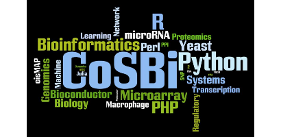

    
    <h1 align="center"><a href="https://ryanccj.github.io/2022_Lab_Training/">2022 Lab Training</a></h1>
    <h3 align="center">Welcome to CSBLab!</h3>

 

## 🔖 Skill in this Summer

- Linux operation
- Python basic data processing
- Pandas、Numpy
- Django

## 📅 Schedule
### Lesson1. Linux
- 7/4 (Mon) Terminal、Virtual Env、Firewall、Tools

### Lesson2. Python
- 7/7 (Thu) Data Structure、Statements
- 7/11 (Mon) Numpy、Pandas + hw1
- 7/18 (Mon) Homework review

### Lesson3. Web
- 7/21 (Thu) HTML、CSS、JavaScript + hw2
- 7/25 (Mon) BootStrap、jQuery
- 7/28 (Thu) Homework review

### Lesson4. Django
- 8/1 (Mon) MTV Structure
- 8/4 (Thu) Database、Models
- 8/8 (Mon) Form、Ajax
    
### Lesson5. Data Visualization (Advanced)
- 8/15 (Mon) Matplotlib、DataTables、Highcarts、D3.js

### Lesson6. Front-end Framework (Advanced)
- 8/18 (Thu) React

### Lesson7. NGS Data Analysis (Advanced)
- 8/22 (Thu)

## ✏️ Homework
Coming soon...

## 📖 Reference
- [1. 2021 Lab Training (github)](https://github.com/ttyy66995/lab_traning)
- [2. 2021 Lab Training (videos)](https://drive.google.com/drive/folders/1kfnuFOqX9FIlL-0zkwwAL60jpEkEPSDD?usp=sharing)

